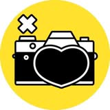

**Текущая тема — Квадраты**

## Темы
1. Круглое
2. Сложная геометрия в улицах
3. Осень 2021
4. Неделя тени и контрастов
5. Витрины
6. Книжное
7. Вид из окна
8. Уличный фонарь
9. Рельсы и поезда
10. Неделя всратой зимы
11. Что-то старое
12. Мост
13. Ситуация на светофоре
14. Цвет
15. Минимализм
16. Цвет и свет
17. Углы
18. Раннее утро
19. Распиздяйство
20. Макро
21. Улицы
22. Как в фильмах
23. Хайтек
24. Животные
25. Урбанизм
26. Двери
27. Стеклянное
28. Стритфуд на улицах
29. Август
30. Люди на улице
31. Отражения
32. Ранняя осень
33. Сраная осень
34. Ступени
35. Балконы
36. Изнанка города
37. Текстуры
38. ЧБ
39. Уличная серия
40. Контраст
41. Автопортрет в отражении
42. Тени
43. Кривые
44. Знаки
45. Одиночечство
46. Движение
47. Силуэт
48. Несовершенство
49. Узоры
50. Бан
51. Цвет
52. Дороги
53. Вывески
54. Чай
55. Зима
56. Игрушки
57. Прямые линии
58. Это могло бы быть обложкой альбома инди-группы
59. Случайный Уэс Андерсон
60. Квадраты — Текущая тема
